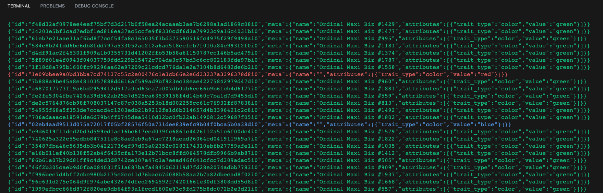

# mcolor
mcolor is a simple tool to extract the color attribute of any image based inscription collections, e.g. OMB.

```
npm i
npm run build
npm run start
```

## Demo




## How does it work

- Step 1: Fetch the image from ordinals.com, for example, we use the OMB collection here: https://magiceden.io/ordinals/marketplace/omb
- Step 2: Extract the colors by converting the images to png (using Sharp)
- Step 3: Find nearest neighbor of the color to the target color categories
- Step 4: Enrich the attributes
